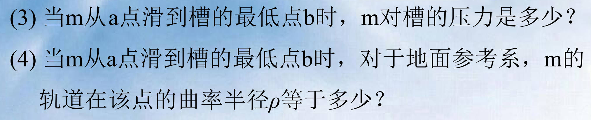

!!! info "课程"

    - 作业/小册 提交时需要手写签名
    - 教材: 东南大学 / 上海交大 / 清华大学 物理学教材

矢量(二维)积分与标量(一维)同样道理

矢量一般写成分量形式: 多少倍的 **$i$** + 多少倍的 **$j$**

知道 $i和j$ 是啥就行, 其他都照常计算, 该咋咋 

## 圆周运动

$\theta$: 角坐标

角加速度 $\beta = \frac {d\omega}{dt}$

角速度: 右手定则

$a_t =\frac{dv}{dt} = \beta R$

$v = \omega × R$

$a_t = \beta × R$

$a_n = \omega × (\omega × R)$

## 相对运动

伽利略变换

在经典力学中, $t = t'$ , 绝对速度$v$ = 牵连速度$u$ 与 相对速度$v'$ 的 **矢量和**

加速度, 位移同理

解题: 用"相对运动 + 水平竖直分解", 需要习惯多少倍的 **$i$** + 多少倍的 **$j$** 的书写形式

"落回抛出点": 在地面系中竖直上抛 $\Leftrightarrow$ 水平速度 = 0

## 质量/牛2牛3

质量测量: 利用动量守恒

$F = \frac{dP}{dt}$ : 高速状态也适用

$F = m \frac{dv}{dt}$

$F = ma$

牛顿第二定律:

- 仅适用于惯性系中的质点
- 建立了一种瞬态关系

惯性质量 & 引力质量

## 重力

是物体在地球参考系中, 万有引力和自转产生的离心力的合力

## 弹性力

只有当绳子质量可忽略, 绳上的弹力才相等

??? info "答案"
    
    思路：取 $\theta$ 处的线元受力分析，切向法向分解列平衡，积分，忽略小量

    
    
    

## 非惯性系中的力学规律

在非惯性系中, 牛顿定律不成立, 引入惯性力 $F_I$, 使得牛顿定律成立

重力: 指向地心的万有引力和垂直于转轴向外的离心力合力

!!! success ""

    要识别非惯性系，并学会用惯性力！

??? info "答案"

    
    

## 动量定理/动量守恒

### 质点系动量定理

作用力反作用力，冲量是矢量，抵消

$$p = \sum p_i，F = \sum F_i，\sum F dt = \sum p$$

$$\int _{t_0}^tFdt = p - p_0 质点系动量增量 = 合外力冲量$$ 

与内力无关

**牛顿定律和动量定理只适用于惯性系，动量守恒也适用于高速/微观**

动量守恒定律：合外力为零；某一方向上同样适用

!!! success "方法"

    当式子中有不好处理的多个小量时，考虑合并！

    - $\frac{dx}{dt} = v$ 之类的

    如果发现只有单个小量，不好处理，看看自己式子列的对不对，有没有落下什么东西，或者继续化简 / 变形之类的

### 质心参考系

!!! info ""

    要求：质心与惯性系只有相对平动

    特点：

    - 原点在质心，$v_c = 0$
    - 总动量 = 0

质点系相对地面的运动 = 随质心整体运动 + 各质点相对质心的运动

$$I = v_c * m $$

!!! success ""

    在某一方向上受力为零，说明质心坐标在该方向上不变

看看火箭公式~

## 功

功是标量，大小与路径有关

动能变化量与惯性系的选择有关，动量变化量与惯性系的选择无关

功能原理：外力做功和非保守内力做功之和等于系统机械能增量

!!! warning ""

    只适用于惯性系，非惯性系要加上惯性力做功

保守力做功只决定于始末态的位置，而与路径无关，即环路积分 = 0

## 角动量L / 力矩M / 角动量定理&守恒

### 角动量

定义：位矢 叉乘 动量 

$$L = r × p$$

### 力矩

定义：位矢 叉乘 力 

$$M = r × F$$

### 角动量定理

$$M = \frac{dL}{dt}$$

$$\int _{t_0}^t M dt = L - L_0$$

$$\int _{t_0}^t M dt称为冲量矩$$

### 角动量守恒定律

内容：对某一固定点若质点所受合力矩为零，则质点对该固定点的角动量守恒

!!! warning ""

    注意 “**对某一固定点**”

    **也有分量式**

