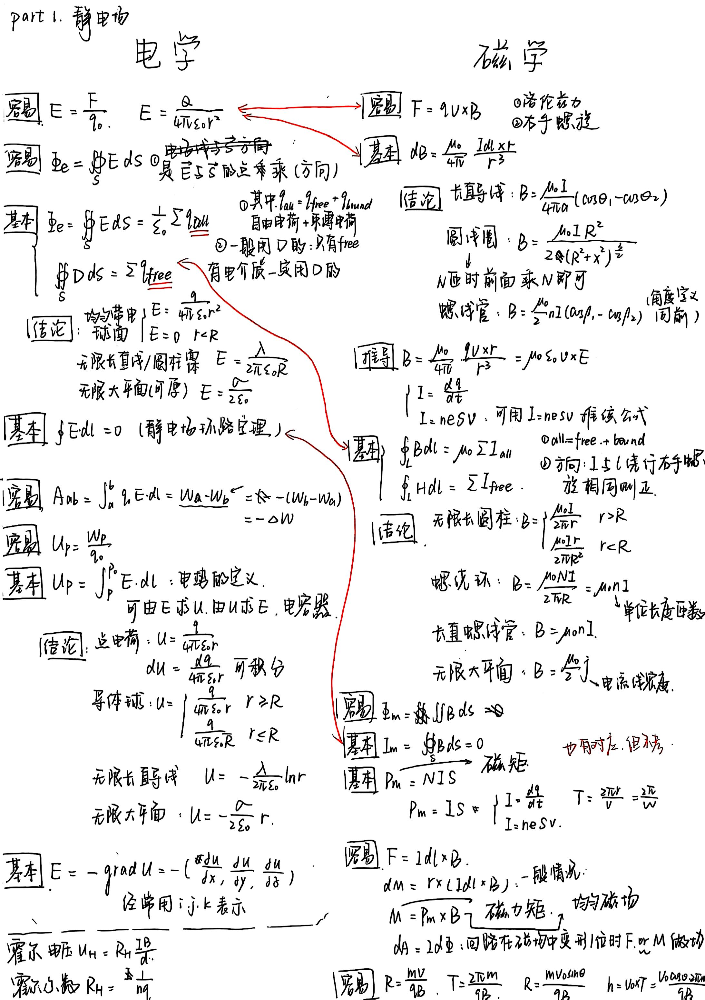

## 电磁学

!!! success "相关链接"

    - [电磁学物理量+公式总结](./electricity_summary.md)
    - [电磁学详细笔记](./electricity.md)

### 手写笔记

PDF 版本: [电磁学复习笔记.pdf](res/files/电磁学公式.pdf)

### 概念性知识

#### 磁介质

磁介质内的磁感应强度$B$ = 真空中原来的磁感应强度$B_0$ + 附加磁感应强度$B'$

磁介质的种类：

- 顺磁质：$B > B_0$
- 抗磁质：$B < B_0$
- 铁磁质：$B \gg B_0$

- 磁介质对外磁场的影响：
    - 分子本身具有磁矩（**固有磁矩**$p_m$），可认为由等效的圆电流（分子电流）产生，由于磁矩取向无规则，它们相互抵消，导致磁介质不显磁性
    - 磁介质处于外磁场时，每个分子均产生与外磁场方向相反的附加磁矩$\Delta p_m$
    - 顺磁质的$\sum p_m \gg \sum \Delta p_m$，且分子受到的磁力矩尽可能使固有磁矩转向外磁场方向
    - 抗磁质的$p_m = 0$，因此附加磁矩是产生磁化的唯一原因

##### 铁磁质的特性

不同于磁化率恒定的其他介质，铁磁质的磁化率会随着磁场变化而变化。由于$B = \mu H$，故通过$B$-$H$曲线研究这一性质：

- **起始磁化曲线**：当铁磁质从未磁化状态开始加外磁场测得的曲线

    

        
    

    - 曲线成"S"型，说明$\mu$不是常数
    - 随着$H$增加，$B$会趋于一个极限值——饱和磁感应强度

- **磁滞回线**：

    

        
    

    - 铁磁质达到饱和状态后，当减小$H$时，$B$的减小呈现出滞后性（磁滞现象）
    - 因此$H = 0$时，$B \ne 0$，称此时的磁感应强度为**剩磁感应强度**$B_r$
    - 只有$H = -H_c$（**矫顽力**）时才能让$B = 0$
    - 此后再减小$H$（增大反向磁场），铁磁质开始反向磁化至反向饱和状态；再沿正方向增加$H$，$B$又会滞后于$H$达到饱和状态，形成磁滞回线
    - 实际上，即使未达到饱和状态就开始减小$H$，也会形成磁滞回线，只是相比之下会小一些（图中的虚线）
    - 磁滞损耗：磁化过程中，会发热消耗能量，与磁滞回线所包围的面积成正比

#### 静电平衡

特点：

1. 导体内部电场为零。 $\rightarrow$ 可以在导体内部取高斯面用高斯定理，得出电荷分布

2. 导体是等势体

3. 电荷全都分布在导体表面，内表面 + 外表面 

    $\rightarrow$ 可以用电荷守恒。
    
    $\rightarrow$ 外部空间的电场分布只由导体整体外表面电荷决定。

静电平衡的特点

- 电荷分布
    - 电荷只分布在导体表面
    - 导体表面场强与电荷面密度的关系：$E = \dfrac{\sigma}{\varepsilon_0}$
    - 孤立导体曲率越大的地方，电荷面密度越大
- 场强与电势
    - 导体内部场强处处为0，导体表面的场强与表面垂直
    - 导体是一个等势体，导体表面是一个等势面

静电屏蔽

- 外部场强无法影响到空腔内，只能引起外表面电荷分布的变化
- 外表面未接地时，空腔内的电荷将影响导体外的电场
- 若外表面接地（电势 = 0），则内外电场互不干扰

    

!!! note "静电场中金属导体问题求解的步骤"

    通常题目要求导体的电荷分布/电荷量/电场分布/电势等

    - 根据静电平衡时导体内无场强与电荷守恒，用高斯定理联系场强与电荷量，求解各个面的电荷量
    - 根据电荷量，用高斯定理、场强叠加等计算导体外部（空腔和外界）的点电荷产生的场强
    - 根据场强，用 **电势定义** 式计算导体表面的电势
    - 一些操作的含义
        - 接地：改变导体所带电荷量，使其电势为0
        - 连接：两个导体等电势，电荷在两个导体间重新分布

### 物理量+公式

#### 一、主要物理量及其含义

|   类别   |                           电学（极化）                           |                           磁学（磁化）                          | 含义简要说明                       |
| :----: | :--------------------------------------------------------: | :-------------------------------------------------------: | :--------------------------- |
|  基本偶极  |               电偶极矩 \(\mathbf{p} = q\mathbf{l}\)              |             磁偶极矩 \(\mathbf{p}_m = I\mathbf{S}\)             | 单个偶极子的强度与方向，分别由电荷分布或电流环决定    |
|  强度矢量  |                      极化强度 \(\mathbf{P}\)                     |                     磁化强度 \(\mathbf{M}\)                     | 单位体积内所有偶极矩的矢量和，反映介质被极化/磁化的程度 |
| 束缚源（体） |          束缚电荷密度 \(\rho_b = -\nabla\cdot\mathbf{P}\)          |       束缚电流密度 \(\mathbf{J}_b = \nabla\times\mathbf{M}\)      | 极化或磁化内部等效产生的“体源”             |
| 束缚源（面） |    束缚面电荷密度 \(\sigma_b = \mathbf{P}\cdot\hat{\mathbf{n}}\)    | 束缚面电流密度 \(\mathbf{K}_b = \mathbf{M}\times\hat{\mathbf{n}}\) | 极化或磁化边界上等效产生的“面源”            |
|   场量   | 电位移矢量 \(\mathbf{D} = \varepsilon_0 \mathbf{E} + \mathbf{P}\) |    磁感应强度 \(\mathbf{B} = \mu_0(\mathbf{H} + \mathbf{M})\)    | 描述介质中电场/磁场与自由源关系的场矢量         |
| 介质响应系数 |      电极化率 \(\chi_e\)，相对介电常数 \(\varepsilon_r = 1 + \chi_e\)     |          磁化率 \(\chi_m\)，相对磁导率 \(\mu_r = 1 + \chi_m\)          | 介质对外场的响应程度（线性比例系数）           |
|   自由源  |                       自由电荷密度 \(\rho_f\)                      |                   自由电流密度 \(\mathbf{J}_f\)                   | 外部给定的真实电荷/电流，是“真正的场源”        |
|   场强   |                      电场强度 \(\mathbf{E}\)                     |                     磁场强度 \(\mathbf{H}\)                     | 描述介质中电磁作用的基本场矢量              |

#### 二、电与磁的对应公式总结表

|  编号  | 电学公式（极化）                                                                   | 磁学公式（磁化）                                                   | 公式含义简述                                                          |
| :--: | :------------------------------------------------------------------------- | :--------------------------------------------------------- | :-------------------------------------------------------------- |
|  \(1\) | \(\mathbf{p} = q\mathbf{l}\)                                                 | \(\mathbf{p}_m = I\mathbf{S}\)                               | 定义单个偶极子的电/磁偶极矩                                                  |
|  \(2\) | \(\mathbf{P} = \dfrac{\sum \mathbf{p}}{\Delta V}\)                           | \(\mathbf{M} = \dfrac{\sum \mathbf{p}_m}{\Delta V}\)         | 定义极化/磁化强度（单位体积偶极矩）                                              |
|  \(3\) | \(\rho_b = -\nabla \cdot \mathbf{P}\)                                        | \(\mathbf{J}_b = \nabla \times \mathbf{M}\)                  | 描述体内极化/磁化产生的束缚源                                                 |
|  \(4\) | \(\sigma_b = \mathbf{P}\cdot \hat{\mathbf{n}}\)                              | \(\mathbf{K}_b = \mathbf{M}\times \hat{\mathbf{n}}\)         | 描述界面上极化/磁化产生的束缚源                                                |
|  \(5\) | \(\mathbf{D} = \varepsilon_0 \mathbf{E} + \mathbf{P}\)                       | \(\mathbf{B} = \mu_0 (\mathbf{H} + \mathbf{M})\)             | 介质中电场与磁场的总场定义式                                                  |
|  \(6\) | \(\nabla \cdot \mathbf{D} = \rho_f\)                                         | \(\nabla \times \mathbf{H} = \mathbf{J}_f\)                  | 电磁场中自由电荷/自由电流的基本方程                                              |
|  \(7\) | 线性介质：\(\mathbf{P} = \varepsilon_0 \chi_e \mathbf{E}\)                        | 线性介质：\(\mathbf{M} = \chi_m \mathbf{H}\)                      | 线性响应关系（介质极化/磁化与外场成正比）                                           |
|  \(8\) | \(\mathbf{D} = \varepsilon_0 (1+\chi_e)\mathbf{E} = \varepsilon \mathbf{E}\) | \(\mathbf{B} = \mu_0 (1+\chi_m)\mathbf{H} = \mu \mathbf{H}\) | 本构关系：\(\mathbf{D}\)、\(\mathbf{B}\) 与 \(\mathbf{E}\)、\(\mathbf{H}\) 的比例式 |
|  \(9\) | \(\varepsilon_r = 1 + \chi_e\)                                               | \(\mu_r = 1 + \chi_m\)                                       | 相对介电常数与相对磁导率定义                                                  |
| \(10\) | \(\oint \mathbf{D}\cdot d\mathbf{S} = Q_f\)                                  | \(\oint \mathbf{H}\cdot d\mathbf{l} = I_f\)                  | 高斯定理与安培环路定理在介质中的形式                                              |
| \(11\) | \(\nabla \times \mathbf{E} = 0\)（静电）                                         | \(\nabla \cdot \mathbf{B} = 0\)                              | 电场与磁场的基本约束关系（静态）                                                |

---

#### 电 ↔ 磁 对应总览表（逻辑对应关系）

| 电学量                               | 磁学量                               | 对应关系说明         |
| :-------------------------------- | :-------------------------------- | :------------- |
| 电偶极矩 \(\mathbf{p}\)                 | 磁偶极矩 \(\mathbf{p}_m\)               | 微观偶极子结构相似      |
| 极化强度 \(\mathbf{P}\)                 | 磁化强度 \(\mathbf{M}\)                 | 单位体积平均偶极矩      |
| 束缚电荷（\(\rho_b,\sigma_b\)）           | 束缚电流（\(\mathbf{J}_b,\mathbf{K}_b\)） | 介质内部/表面等效源     |
| 电位移 \(\mathbf{D}\)                  | 磁场强度 \(\mathbf{H}\)                 | 分别与自由电荷/自由电流相关 |
| 自由电荷 \(\rho_f\)                     | 自由电流 \(\mathbf{J}_f\)               | 外部真实源          |
| 电介质常数 \(\varepsilon,\varepsilon_r\) | 磁导率 \(\mu,\mu_r\)                   | 介质响应系数         |
| 电极化率 \(\chi_e\)                     | 磁化率 \(\chi_m\)                      | 线性响应比例系数       |
