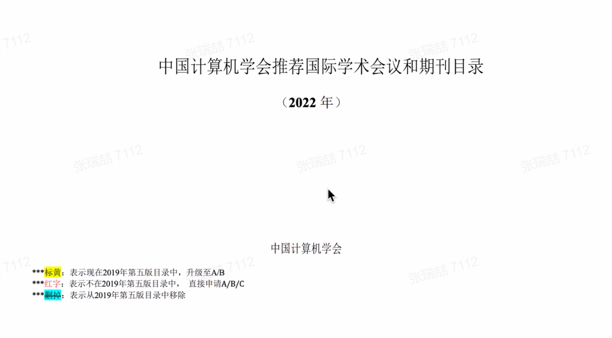
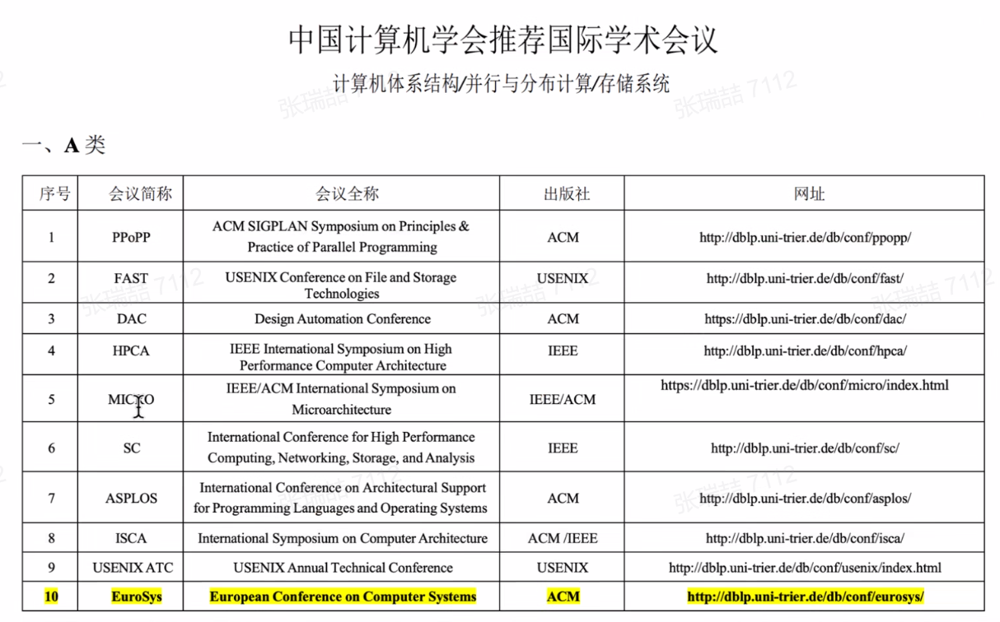
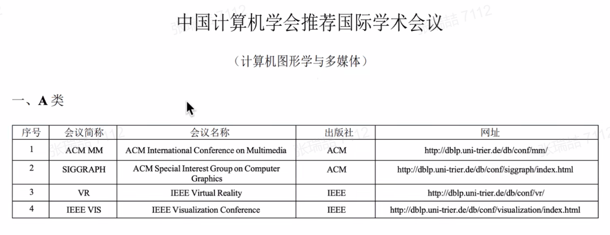
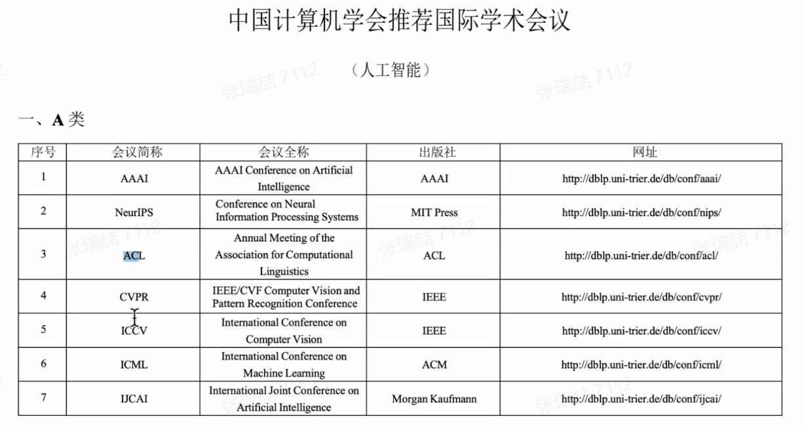
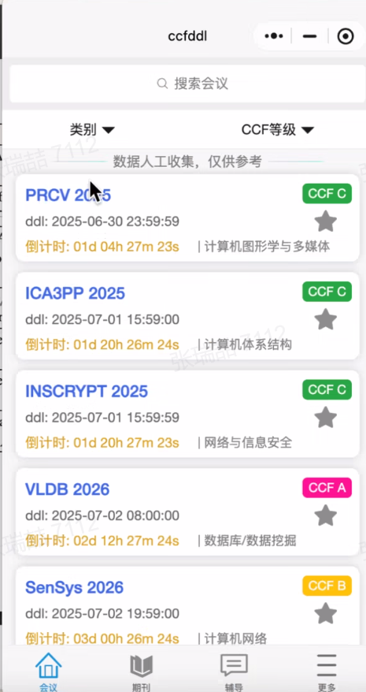
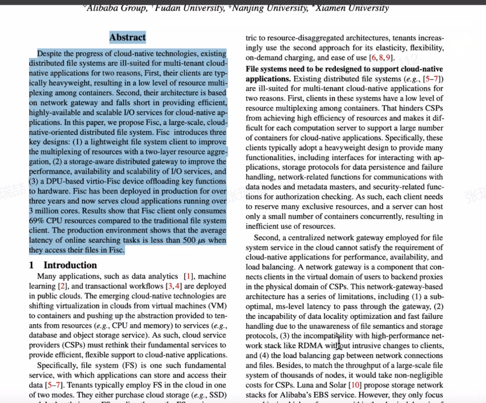
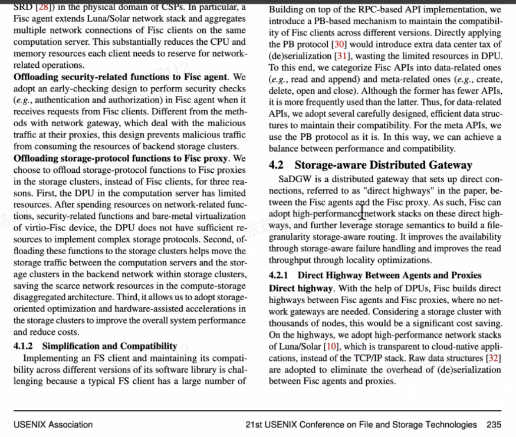
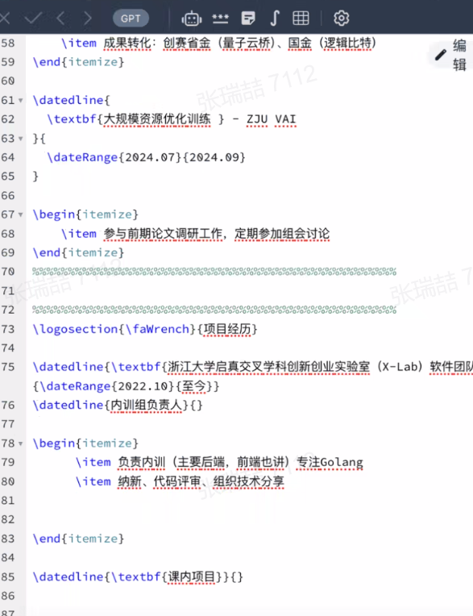

!!! info "01gg简介"

    - 浙江大学计算机学院2022级本科生
    - 继续深造读研

投稿，投会议多，因为新

小程序：投稿ddl提醒

DBLP 文库

arxiv 可以找文章

先拿飞书云文档写文章，再最后拿latex排版

openreview.net 上面看审稿结果

学术写作资料

科研是个啥？

- 探索行业前沿×
- 做实验，发现一个idea不错，发文章√
- A会发上万篇能历史上留名的就两三篇
- 科研，适不适合你，不一定，因为，就是得要量化数据
- 多看看文章感受感受吧，就知道学术期刊怎么写了
- 要科研，大二暑假进实验室/暑研
- 浙大计院很热门，外校也想
- CAD 可视分析小组