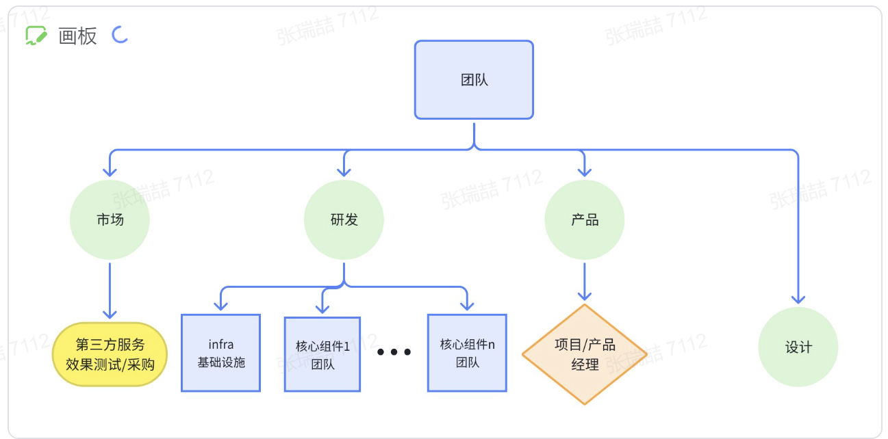
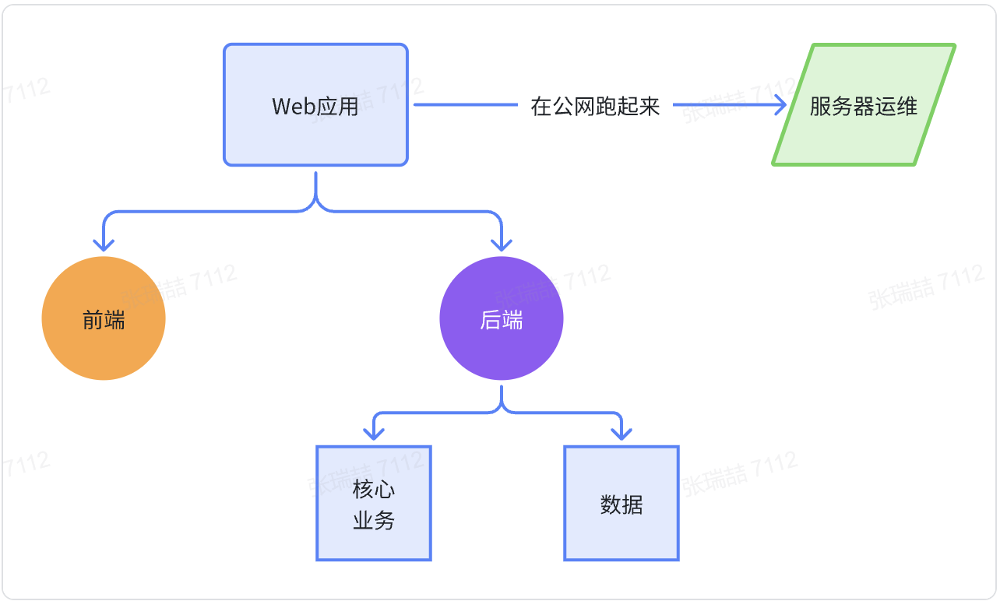
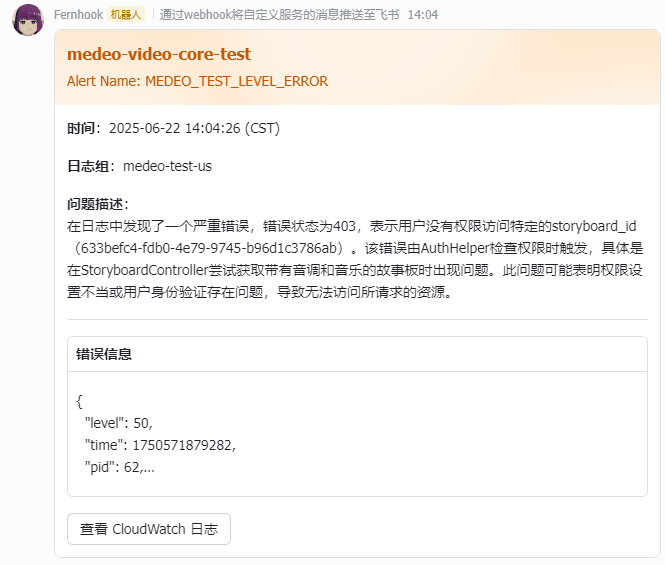
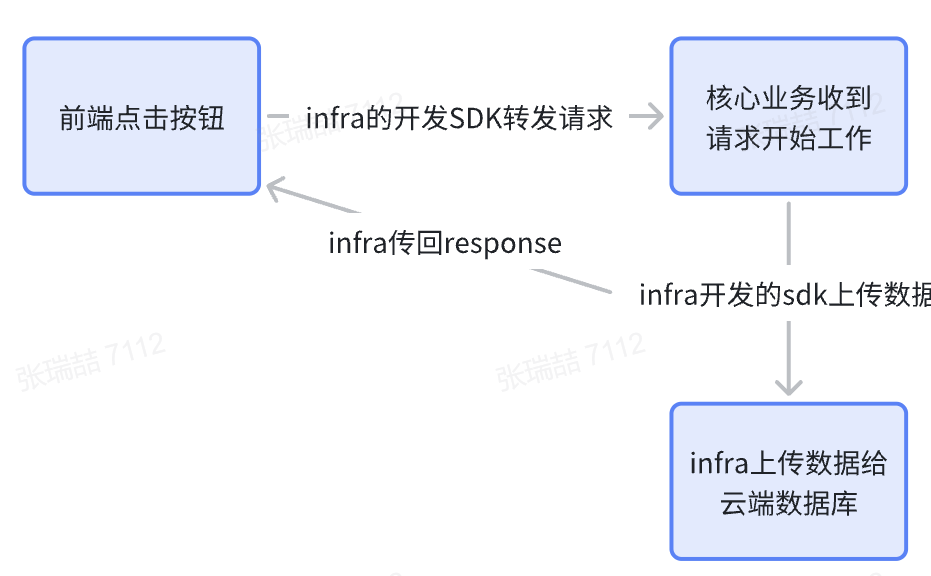
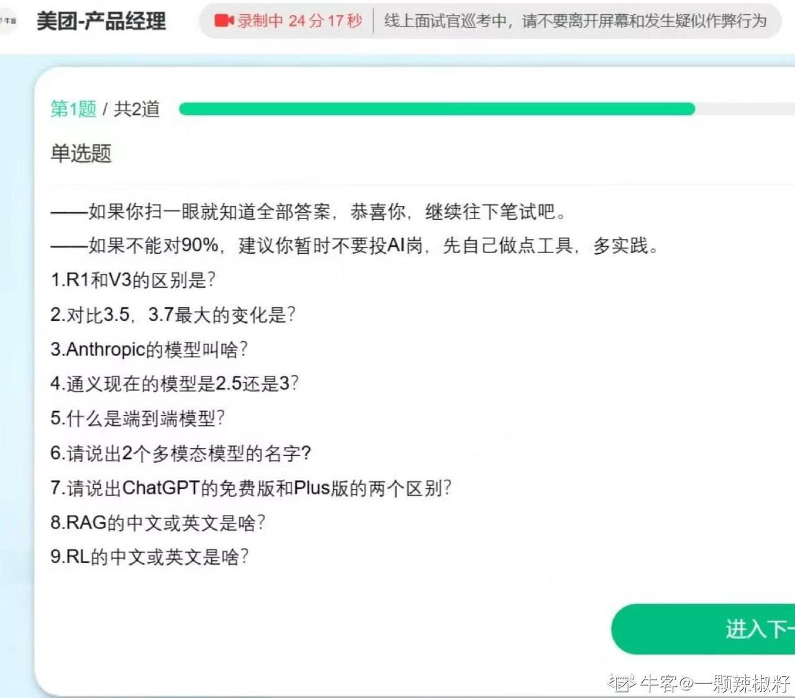
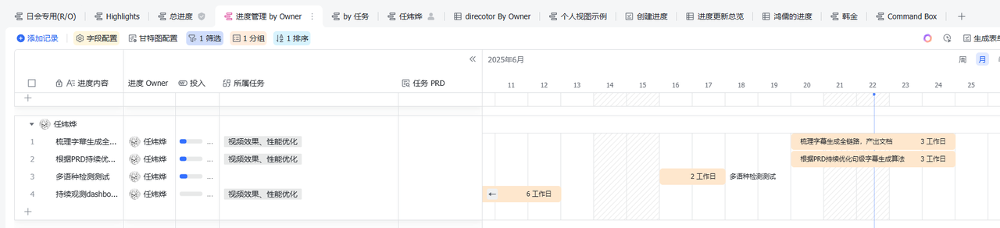
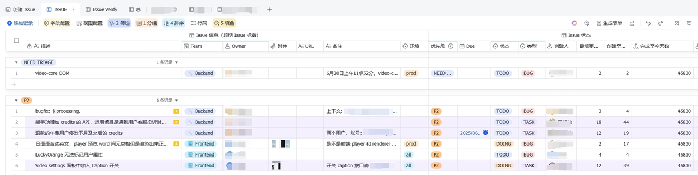
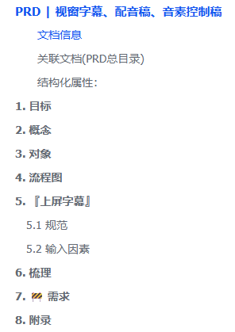

!!! info "任炜烨学长简介"

    - 浙江大学计算机学院2022级本科生
    - 现拿到大厂秋招offer，本科就业

## 公司的人员架构是什么样的

这里我们忽略公司财务、法律顾问等公司商业运营所需的人员。

关注一个公司的核心产品背后的开发团队是怎样的
暂时无法在飞书文档外展示此内容

在我所在实习公司，开发一个产品会涉及到4个职能部门/团队。

## 市场

有些同学可能买过大模型的API TOKEN，这种付费服务对于我们企业来说也是必要，当然并不限于调模型API这一个场景

市面上有些公司的主要业务就是提供外部服务的，而为公司采购外部服务，讨价还价并测试服务质量就是市场团队的人在做的事。

## 研发

此处就是各位程序猿施展手脚的地方了）

### infra基础设施：

一个企业级的应用，运行过程中产生的所有数据都存储在云端服务器（AWS）的数据库中，因此如何访问数据、如何上传数据会由infra团队提供统一的接口，以Python SDK和TypeScript SDK的形式提供。
另一方面，infra团队还需要运维服务器，那么运维究竟是做了什么事呢）包括监控服务器的吞吐率，某个具体组件的CPU性能，服务器崩溃后的紧急修复等。
同时为了提高运维监控的效率，infra团队还开放了一系列告警飞书机器人

同时他们还开发了其他的机器人，如果github动态机器人（推送github team中任意一个仓库的动态，如push commit，delete branch，deploy branch）PR急急急机器人（推送github team中任意一个仓库的pull request）

### 前端团队：

承接所有UI/UX实现，根据设计团队提供的Figma设计图落地前端ui。并承担编写Ajax的任务，需要与后端团队完成数据的接口联调。

同时我们公司的前端团队还承接了开发两款自研产品的任务，一个是开发自研前端框架（类似React)，一个是Figma-Code（设计图转代码）

（将设计图转换为code）

### 后端（核心组件）团队：

该团队开发产品的核心业务逻辑，编排应用的工作流，接入第三方服务。

和infra后端的区别：

## 产品

### 项目经理

**整个开发团队的话事人、开发进度的掌控者**

*一般都是走晋升，必须得有强的技术基础*

*也得需要市场调研*

项目经理必须懂技术，而且非常懂，有非常广的技术知识与熟练的开发经验，能敏锐地看出某个bug怎么来的

职责：组织每日的技术日会，同步过去一天内出现的bug的issue，询问bug的处理进度，询问每个人的最近的开发情况，保证开发的进度正常推进。

日会外的时间，如果告警机器人报出bug，他是bug的第一个审查人，并做出判断，正确地assign正确的人来处理这个bug。

使用飞书的多维表格维护整个项目的进度管理

bug和issue的管理

## 在企业是怎么进行开发的

### 该怎么开发，开发成什么样

开发并不能靠开发人员的俺寻思之力，不能是开发人员拍脑袋写出一版代码就行的事。

开发前端应用时，我们会先请设计师先在Figma上把设计图画出来，然后前端工程师再按照设计去写代码落地设计图上的UI设计。

开发后端应用时，我们则需要明白整个后端系统该如何建模，数据表之间该如何设计，系统有什么性能和效果上的要求

因此就有了产品经理

在某一个需求被提出时，正确的流程为：

产品经理调研市场->验证确实可行->为研发人员提供PRD（产品需求文档）->研发人员完成开发->产品经理进行验收

### 如何本地开发，如何验收测试

企业级的开发，不得不提的一个概念为生产环境（prod），即系统在真实公网进行运行的环境。

类似的，我们还有本地开发环境（dev)，测试环境（test）

当研发人员收到了某个bug或是需求时，都是在本地环境将代码写好，完成测试，正确无误后，再推送代码至远程仓库，仓库便能触发自动的工作流，将代码部署至test环境，而后在test环境观测一段时间，验证了稳定性和正确性后，便能同步到prod环境（或是等等，到时候和其他修改一起攒一波大版本更新上去）

同时，企业级的开发项目还注重鉴权，因此成功在本地跑通代码还需要填写大量的鉴权参数（大多数是第三方服务的API KEY），如果python项目就可以利用项目根目录下的.env文件和app/config目录下的settings.py来完成鉴权

### Git使用，怎么进行PR

git的使用是在公司进行项目开发和版本管理的基本功。虽然在大部分场景下，add，commit，push，log，pull，checkout等操作就全OK了，但是也需要熟练rebase，merge等操作。

然后是代码的推送，所有的开发工作都应该在自己的独立分支上完成，对main的推送是非法且不能接受的（而且你也一般没有往main推代码的权限）。所以就需要在推送了自己分支的代码后及时发起Pull Request，在这步，你需要编写详细的PR介绍，方便reviewer了解上下文。在reviewer对你的修改完成code review，你按照修改建议将修改好的代码push上后，就能把你的代码合进主分支了。

PR：需要一个权威的人进行代码审查

### 怎么写技术文档

1. 养成附上下文/Context 的习惯
2. 先明确这篇文档背后任务的的『终极目标』和『解决什么问题』，再看这篇文档的『目标』和『解决什么问题』

