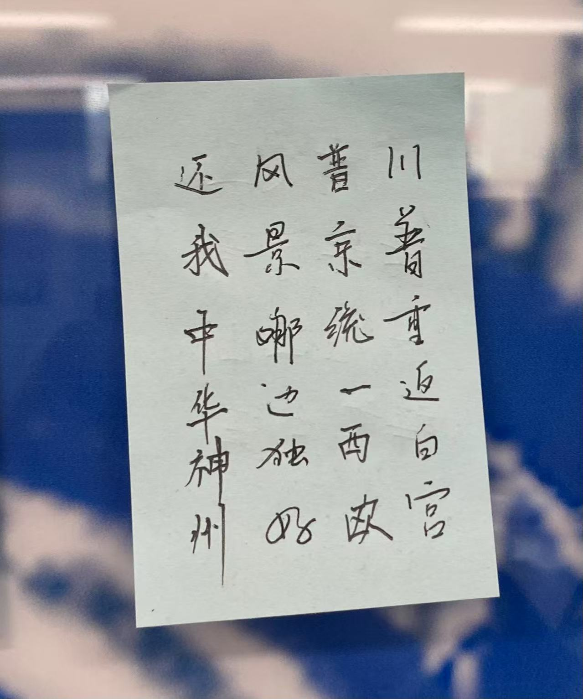

说实话从来没有如此正式地撰写年度总结的习惯，往年不过是朋友圈 + 群发消息 + 回复对方的群发消息。但不平凡的甲辰年实在不允许我敷衍地总结，遂作此文，略抒己见。

## World

如总书记2023新年贺词所言，“百年变局加速演进，世界并不太平”，2024年世界的大动荡、大变革的形势愈发明显。

中东战火重燃，加沙地区生灵涂炭，人道主义事业陷入极大危机；美国一票否决巴勒斯坦入联申请，不禁联想到1919年顾维钧振臂高呼“你们凭什么把中国的山东省送给日本人？！”；全球70多个国家进行重要选举，trump 在 musk 的支持下重返白宫、法国总理走马灯般接连表演、德国执政联盟正式破裂、韩国总统被捕……此外，全球经济形势亦复杂多变，产业链供应链的碎片化重构、美联储货币政策调整引发经济形势变化，以及金融科技与数字货币蓬勃发展。

无穷的远方，无数的人们，都与我有关。

> 本人主修软件工程，对国际政治学/国际金融学的了解仅限于大一上学期修的世界经济导论课以及平日看到的新闻，如有专业错误烦请各位看官及时指正。

那么，小左同学当年的大作会不会实现呢？

## Technology

仿佛一切都按下了快进，开启了3倍速，AIGC无疑是年度主角，其他领域的科技创新亦异彩纷呈。

OpenAI高层剧烈变动，GPT-5未能如期发布，但4o仍展现出强大实力，理解物理世界的sora的推出更颠覆了视频创作；另外，公司资金投入持续增加，预计亏损将达到50亿美元，并加大融资规模、更加激进地商业化。

Google在年底发布了多模态大模型Gemini2.0和视频模型Veo two，眼见为实的古训进一步被颠覆。

Meta团队发布混合模态Chameleon，可以在单一神经网络无缝处理文本和图像，其大模型Llama3.3和即将推出的Llama4亦备受关注，此外，Meta还探索了除了大语言模型之外的其他AI路径，如大型概念模型(LCM)。

年底爆火的国产开源大模型DeepSeek也参与到这场追逐，甚至被硅谷巨头称为“东方神秘力量”。基地训练成本、支持多模态、模型全开源，超越DALL-E3、直追o1、致使英伟达股价下跌16.97%，市值一日内蒸发近6000亿美元，创美国历史上任何一家公司的单日最大市值损失，均展示了国产AI不容忽视的实力。

此外，机器人、脑机接口、游戏开发等领域亦百花齐放。

## Me, Myself

前些日子看到美国新兴上市 AI 搜索引擎公司 Exa 的 CEO William Bryk 对前端工程师的评价，是这个职位将在三年内完全被 AI 取代， 继而世间再无前端工程师，而他给到数学家的时间也仅有 700 天。另有证据表明，美国不少初创，已经不再雇佣前端程序员，直接由AI来写；而后端很多工作，也已经岌岌可危。感慨时代发展如此迅捷的同时不经生出一丝寒意：我所在的专业对口的职业不仅面临人才井喷困境，还有被新技术取代的可能。怀疑当初自己的选择的同时更多的去思考在如此处境下应该如何破局……

龙年，经历了目前看来还算人生中比较重要的事件——高考，失意也是有的，若需抱怨也只能怨没有在高三尽全力学习的我。来到杭州，进入三墩镇人民公园。

前半年，清点着做不完的小卷子，收集着用尽的中性笔芯，闲暇之余与好友以讲台为球台、以粉笔盒为网，进行各种球类运动（详情请见）。有焦虑，有彷徨，我的大脑似乎刻意遗忘了许多带有负面情绪的细节，若不是几天前翻看聊天记录也不会记起。

后半年的关键词应是扩大舒适圈。暑假，一个有强迫症的j人做了人生中第一份特种兵出行规划，然而实操过时发现空余了大把时间。开学后充分发挥e人属性，有幸结识天南海北众多好友。专业分流前期无所事事但是国庆时疯狂预习，也是抢先拿到了考试周体验卡。在学长的指导下体会了技术世界的乐（tong）趣（ku），无情敲命令、痛不欲生debug、建立赛博个人世界，以及最棒的markdown和latex让我摆脱了Word的魔爪。期中周再游上海、期末周读完数本课外书，难道这就是大学生的松弛感吗？此外，读万卷书，行万里路，价值观受到了极大冲击，自我意识逐渐觉醒，或许略有离经叛道、与群体观念背道而驰，但在这个多元的世界又哪有孰是孰非？

回到最开始的问题，因为最初的热爱，经历了一道题做七八个小时也做不出来、因痛恨自己无能而彻夜debug终于奇迹般的做出两道半等等的痛苦之后，进入软件工程专业，但发现该方向前景堪忧，我该何去何从？推而广之，在AI时代下，生存于世的每一个个体该何去何从？

私以为每个人的生命都是一条通往自我的旅途，沿着自己的路向前走，不管它通向何方。当找到自己，确认自己，喜欢自己，国际动荡、技术变革便成为“环境变量”，“自变量”仍是个体的的初心。如果功利一些，如 Naval Ravikant 所述，在这个知识信息更新迭代速度加快的时代，在一种知识从产生到没落的不到十年的周期内，如何在一年内掌握并在余下时间使其为自己创造最大价值是我们每个人都需要思考的问题。那么这种知识的获取岂是能通过学校教育获得的？仍旧是自我探索罢了。

追风逐日、寻真求本，是多么伟大的品格！

打开微信公众平台，看到了我的第一个非通讯录粉丝，特别欣慰文章能给各位带来帮助和乐趣，也特别感谢各位捧场~

这里也祝我们的祖国时和岁丰、繁荣昌盛！祝大家被鲜花拥簇，看大海漫漫，热烈且自由，赤诚又勇敢！

韶华长在，明年依旧，相与笑春风~
