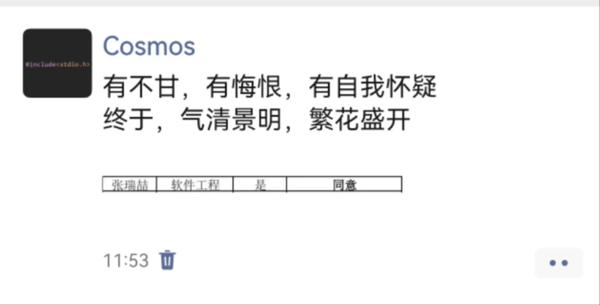
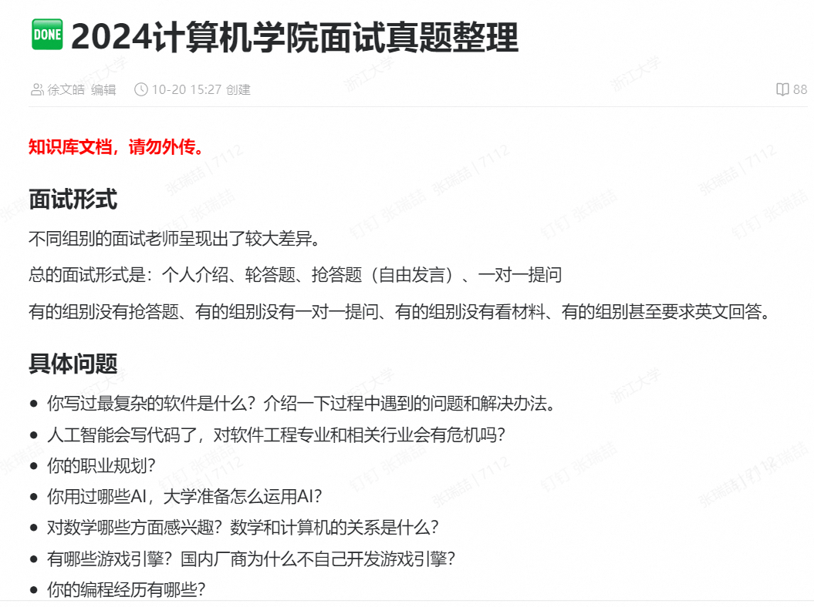
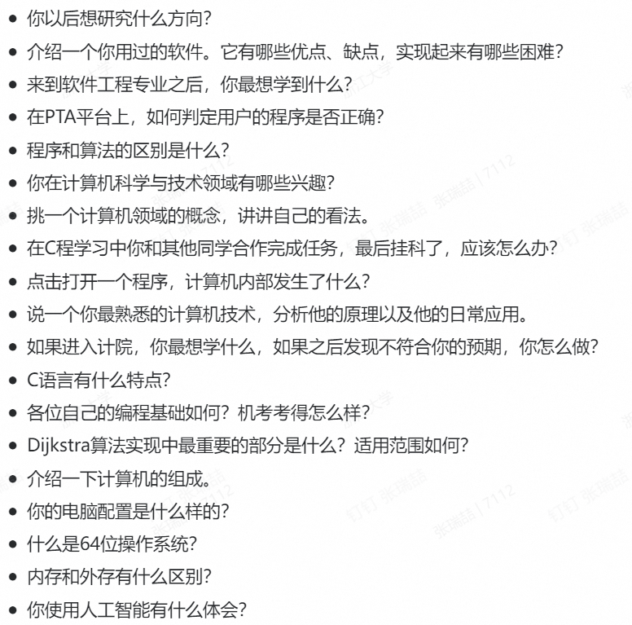

# 面试
!!! success "写在前面"

    沈黎勇老师说从上大学到工作你会经历20~30场面试，如果目标特别坚定也会有10~20场。

## 浙江大学校学生会志愿者
cnt = 2

确实有些古久了，列一些关键词吧。

压力面：严格卡时间、面试官语气咄咄逼人、问题难以回答（也是就简历提出相关领域的问题）

同组同学：学生工作履历丰富、表现欲强到令人反胃但无力

## 浙江大学云峰学生会科创中心
cnt = 3

直接忘了！迟到了！

这就注定了你是失败的，尽管你在面试过程中竭尽所能展现自己。

有了这样的教训，以后的任何事情你就知道该怎样做了

## 主修专业确认
cnt = 6
### 第一轮 第一志愿计算机科学与技术

??? question "问题整理"

    1. 自我介绍

    2. C和python区别，C和python变量分别代表什么
    
    3. 你在写C代码的时候遇到了哪些问题？
    
    4. 你未来的规划

#### 关于面试
真相: 面试基本没人看，基本纯看机考。而我编程题一题1分、二题0分。
>“你猜他为什么突然加一个机考？”

结果可想而知了，

也还是说说吧，

- 自我介绍背稿子的感觉太严重！语速极快，别人也听不清啊。也主要是怕到1min打断我，这样的话在准备稿子的时候可以压缩。
- 穿西装是不是显得有些刻意？

    >“我觉得就你们学校里的面试没必要吧？”

- 有些问题回答得没有营养: 就你回答问题是要展示你，不是闲聊，所以以后面试对每个问题都需要慎重。
    
    就人家问写C代码有什么困惑，我说忘加分号；；；

- 不要被别人影响了，不要被别人的思路禁锢，别人怎样回答问题你不要管，尤其不能接着他说。

#### 反思提升
怎么说吧，前期做了比较 (**？**)充足的准备

这就不得不提机考了，也反思一下你失败在哪里

<strong>假装努力/效率低下</strong>

&nbsp;&nbsp;&nbsp;&nbsp;&nbsp;&nbsp;&nbsp;国庆那段时间，没回家，整天在主图坐独坐学线代微积分。说实话学习效率挺低的一天坐那一上午学数学，下午晚上做一道洛谷。中间还经常看看短视频看看手机还看看一些与当下学习无关的东西。

&nbsp;&nbsp;&nbsp;&nbsp;&nbsp;&nbsp;&nbsp;确实……

&nbsp;&nbsp;&nbsp;&nbsp;&nbsp;&nbsp;&nbsp;学各种高端的东西也就效率挺低的哇。有时候也有点太过也注重形式，一个笔记记半天: 打字太慢……

<strong>信息搜集</strong>

&nbsp;&nbsp;&nbsp;&nbsp;&nbsp;&nbsp;&nbsp;学园9.30就发出专业确认的通知，我就没看到，也就没意识到应该往后学学C程；看的学长发的去年的方案，也没啥学习的动力

<strong>缺乏真正的内驱力</strong>

&nbsp;&nbsp;&nbsp;&nbsp;&nbsp;&nbsp;&nbsp;如果，你真的，对一件事特别渴望，你会去，全力以赴的，你会去，专心致志的

&nbsp;&nbsp;&nbsp;&nbsp;&nbsp;&nbsp;&nbsp;怎么说，明明知道有机考，很重要，还是没有好好学啊，就没有全力以赴啊，每天还经常看看短视频看看手机还看看一些与当下学习无关的东西（自己解释说长久的发展有好处，自我提升。但是提升你等之后也有时间啊）

&nbsp;&nbsp;&nbsp;&nbsp;&nbsp;&nbsp;&nbsp;自己也在说啊专业分流关乎未来人生的发展，也还没当回事。

<strong>学知识一知半解不钻研</strong>

&nbsp;&nbsp;&nbsp;&nbsp;&nbsp;&nbsp;&nbsp;现在依然是这个问题，你问了ChatGPT, 问了Kimi啥的，看看他给的文字，专业术语太多，看不懂，于是直接copy代码or命令，没有任何思考直接paste。

&nbsp;&nbsp;&nbsp;&nbsp;&nbsp;&nbsp;&nbsp;这问题！改！

<strong>提前正确规划并执行</strong>

&nbsp;&nbsp;&nbsp;&nbsp;&nbsp;&nbsp;&nbsp;规划挺好，太空泛，没有执行的内驱力。

### 第一轮 第二志愿光电科学与工程

面试结束，立马登上了去上海的火车……

??? question "问题整理"

    1. 自我介绍

    2. 用英语，介绍一个光学现象

    3. 说一个体现你抗挫能力的事情

#### 关于面试
- 自我介绍好多了，语速慢了很多，有强调重点。
- 有些问题回答的很shit，还是被别人的回答把思路禁锢住了: 还是上面那个问题。
```
Q: 英语介绍一个光学现象
A: 色散……？

Q: 抗挫能力
A: 上大学事多……？
```
- 依然是正装，
- 投其所好，搬出英才计划，挺好的。

### 第二轮 软件工程

***cheeeeeers！***


#### 记录一下
<div style="text-align: center; font-weight: bold; font-size: 1.2em;">
  幸运与遗憾
</div>

&nbsp;&nbsp;&nbsp;&nbsp;&nbsp;&nbsp;&nbsp;既然成功了，就先说说幸运吧。

!!!success

    首先，隆重感谢gsgg指点！鞠躬！

&nbsp;&nbsp;&nbsp;&nbsp;&nbsp;&nbsp;&nbsp;听闻第二轮专业确认信息，及时询问gsgg该如何准备，便开始了紧锣密鼓的备战。

&nbsp;&nbsp;&nbsp;&nbsp;&nbsp;&nbsp;&nbsp;一轮的失败，确实影响很大，时常就有这些想法在我脑中回荡。写到这，不禁想起和wcy聊天过程中的思考，高中的那个学习机器是不会这样想的，他大概只会逆来顺受随波逐流精神胜利法，心理没有任何波澜。

&nbsp;&nbsp;&nbsp;&nbsp;&nbsp;&nbsp;&nbsp;有自我怀疑啊，我真的适合计算机吗？我的成绩我的水平真的配进高贵的计院吗？

&nbsp;&nbsp;&nbsp;&nbsp;&nbsp;&nbsp;&nbsp;有焦虑啊，万一进不了怎么办？别人会怎么看你？

&nbsp;&nbsp;&nbsp;&nbsp;&nbsp;&nbsp;&nbsp;有想过放弃啊，要不就在光电吧。

&nbsp;&nbsp;&nbsp;&nbsp;&nbsp;&nbsp;&nbsp;也有精神胜利法啊，zju光电也很好啊全国第一，国家有需求将来很好就业啊，说不定我能爱呢？


2024.11.11周一

&nbsp;&nbsp;&nbsp;&nbsp;&nbsp;&nbsp;&nbsp;开始报名，也开始了准备。大英课上，偷偷拿手机询问，gsgg说搞个项目、学点语言、学点工具。中午吃饭的路上就在搜他说的各种我听不懂的词汇，上b站搜教程。下午线代也翘了，在宿舍无情开码，一边看教程一边贪吃蛇。写完了，玩了玩，成就感满满。

2024.11.12周二

&nbsp;&nbsp;&nbsp;&nbsp;&nbsp;&nbsp;&nbsp;上午，重操旧业，我的网站！那次花了一天的时间最后一直出错。原因是git不熟悉每次都搜，没有一步一步按着教程来，总想着快进当时看着那个教程都感觉恶心……导致我一开始打开都有轻微抵触。于是先学了些git再开始，果然轻松多了，2h完工！

&nbsp;&nbsp;&nbsp;&nbsp;&nbsp;&nbsp;&nbsp;军理签到？签完就走……

&nbsp;&nbsp;&nbsp;&nbsp;&nbsp;&nbsp;&nbsp;下午晚上，开始Python！挺好从不会的忘记的开始毕竟有基础。数据容器、面向对象、调包、爬虫。

2024.11.13周三

&nbsp;&nbsp;&nbsp;&nbsp;&nbsp;&nbsp;&nbsp;Python again，到晚上终于草草率率学完了但是后面有些东西还是不行。

&nbsp;&nbsp;&nbsp;&nbsp;&nbsp;&nbsp;&nbsp;最后也是在多方辅助下写出来我的第一个爬虫，迫不及待开始尝试。但是总是返回码127，自己搜，也没搞清楚。深夜里不停的尝试，一遍一遍python3，最后问问kimi，把chromedriver安装并更新，终于！那个linux chrome图形界面弹出时！多么激动！多么兴奋！记得上面没有显示出完整的文字知识一排方框，记得好多次他自己莫名其妙关闭，记得爬完整250条总是成功不了……

&nbsp;&nbsp;&nbsp;&nbsp;&nbsp;&nbsp;&nbsp;补了一个注释：“这时候你可以去吃饭去了，爬这些数据得一段时间了。”遂开吃，甑糕。

&nbsp;&nbsp;&nbsp;&nbsp;&nbsp;&nbsp;&nbsp;那时，已经接近2点了。

2024.11.14周四

&nbsp;&nbsp;&nbsp;&nbsp;&nbsp;&nbsp;&nbsp;不停的在调整网站的配置，也有怀疑这是不是抓不住重点，也想学学HTML、CSS、JS，最后一拖再拖，没有开始。

&nbsp;&nbsp;&nbsp;&nbsp;&nbsp;&nbsp;&nbsp;把个人简历、个人陈述、自我介绍写了。

&nbsp;&nbsp;&nbsp;&nbsp;&nbsp;&nbsp;&nbsp;晚上又写出来一个爬虫，导致豆瓣成功把我的IP禁了。

2024.11.15周五

&nbsp;&nbsp;&nbsp;&nbsp;&nbsp;&nbsp;&nbsp;上午在宿舍，熟悉了一下面试自我介绍，熟悉了一下我写的那些个项目代码，紧紧张张看了看HTML、CSS把材料印好认认真真保护好。

    下楼之前不下雨，遂未带伞。彩色打印机，￥29，思考怎样装订，回时下雨，检查，发现AI补全我的奖项的是错的，询问有无资料袋，无，遂套两个塑料袋。改，印，锁入柜。

&nbsp;&nbsp;&nbsp;&nbsp;&nbsp;&nbsp;&nbsp;想着背水一战吧，其实也挺平静的。在教室和教室门口等候的时候也没有了一轮时的紧张，挺放松，甚至摇头晃脑唱起了歌……（正式面试喀什不敢这样！形象！就像一轮两次，西装革履、正襟危坐。

&nbsp;&nbsp;&nbsp;&nbsp;&nbsp;&nbsp;&nbsp;遗憾也是有的。

&nbsp;&nbsp;&nbsp;&nbsp;&nbsp;&nbsp;&nbsp;没有再提前一点准备，如果再提前一点，是不是有时间复习一下简历上写的东西？是不是有时间再写一个游戏？是不是有时间复习一下我贪吃蛇的代码？是不是有时间把HTML/CSS/JS再深入学学？

&nbsp;&nbsp;&nbsp;&nbsp;&nbsp;&nbsp;&nbsp;中间学习效率还是没有达到满级，尤其Python那段：学东西要记在大脑里，而不是记在电脑里。


#### 关于面试
这次都是指名道姓问我

??? question "问题整理"

    Q: 贪吃蛇图形化界面？
    A: 是。
    Q: 多少借鉴的？
    A: 先想逻辑，再一边自己写一边AI。
    Q: 调用了什么库？
    A: 就pygame。
    Q: 还有什么？
    A: 没了。
    Q: pygame图形化界面底层什么原理？
    A: 不知道

    Q: 你说你了解SSH，问你一下主机虚拟机之间传文件用的是什么命令？ 
    A: 不知道，我用git中转

    Q: 讲讲你了解的排序算法？
    A: （前面人说了）我知道qsort
    Q: qsort和快排有啥区别？
    A: 不知道

    Q: 你的爬虫肯定会遇到很多问题，你怎么解决的？
    A: 一个是return127的，我把chromedriver安装更新了一下；一个是豆瓣把我IP禁了。
    Q: 这是一个很常见的问题
    A: 还没研究。

    Q: 你说你在学习JS，讲讲他的特点？
    A: 我才刚开始学
    Q: 他和python有什么区别？
    A: 我不知道。
    Q: ……（忘了）？
    A: 我只知道他和交互有关。


都是以我不知道结尾……

有几点，

- 简历上写的东西就要完全深入学习，要写给学明白了，只知道皮毛中的皮毛千万不能写！这就是个学校里的小面试，将来工作面试人家发现你简历上的东西都是假的怎么办！这是学术造假行为！幸好……

- 面试的时候脑子要转！不能凭惯性！就跟你考试一样，总是大脑不转凭惯性。要思考怎样回答，思考我学过的知识。

总之，最后的最后，


&nbsp;&nbsp;&nbsp;&nbsp;&nbsp;&nbsp;&nbsp;

附注: 2024zju主修专业确认第一轮计院面试真题，供后人参考





<div style="text-align: right;">
    2024年11月17日 作于求是园
</div>

<script src="https://giscus.app/client.js"
        data-repo="r-z-zhang-AI/r-z-zhang-AI.github.io"
        data-repo-id="R_kgDONN6JTg"
        data-category="General"
        data-category-id="DIC_kwDONN6JTs4CkfL9"
        data-mapping="pathname"
        data-strict="0"
        data-reactions-enabled="1"
        data-emit-metadata="1"
        data-input-position="bottom"
        data-theme="preferred_color_scheme"
        data-lang="zh-CN"
        crossorigin="anonymous"
        async>
</script>
