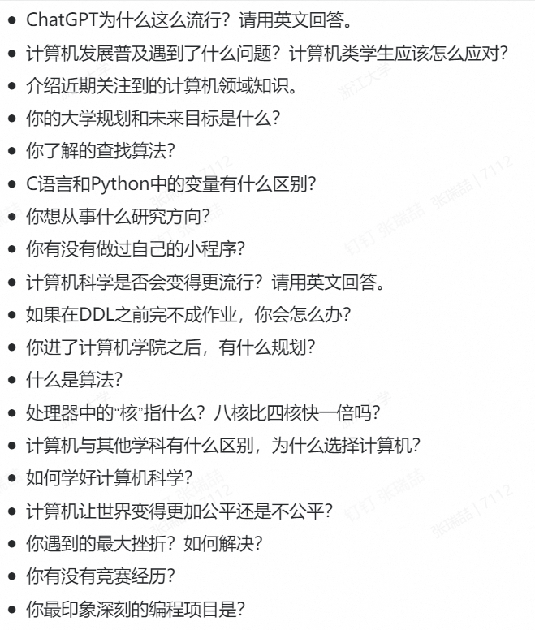
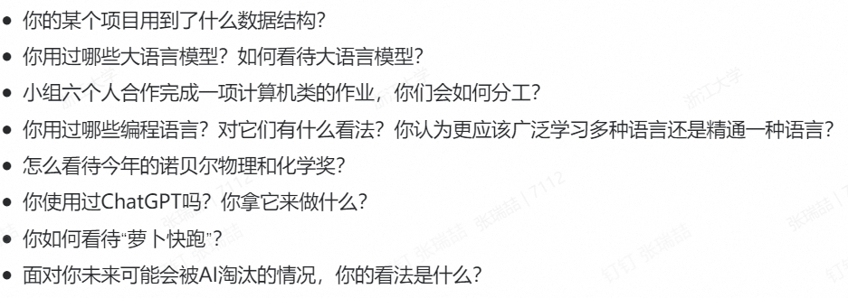

# Interviews
Creating date: 2024-11-17 1:42

## 主修专业确认
### 第一轮 第一志愿计算机科学与技术

???问题整理

    自我介绍
    你未来的规划
    C和python区别，C和python变量分别代表什么

怎么说吧，前期做了比较 ***？***充足的准备？

这就不得不提机考了，也反思一下你失败在哪里

#### 假装努力/效率低下
&nbsp;&nbsp;&nbsp;&nbsp;&nbsp;&nbsp;国庆没回家，整天在主图坐独坐学线代微积分。说实话学习效率挺低的一天坐那一上午学数学，下午晚上做一道洛谷。中间还经常看看短视频看看手机还看看一些与当下学习无关的东西。

&nbsp;&nbsp;&nbsp;&nbsp;&nbsp;&nbsp;学各种高端的东西也就效率挺低的哇。有时候也有点太过也注重形式，一个笔记记半天：打字太慢……
#### 信息搜集
&nbsp;&nbsp;&nbsp;&nbsp;&nbsp;&nbsp;学园9.30就发出专业确认的通知，我就没看到，也就没意识到应该往后学学C程；看的学长发的去年的方案，也没啥学习的动力

#### 缺乏真正的内驱力
&nbsp;&nbsp;&nbsp;&nbsp;&nbsp;&nbsp;如果，你真的，对一件事特别渴望，你会去，全力以赴的，你会去，专心致志的

&nbsp;&nbsp;&nbsp;&nbsp;&nbsp;&nbsp;怎么说，明明知道有机考，很重要，还是没有好好学啊，就没有全力以赴啊，每天还经常看看短视频看看手机还看看一些与当下学习无关的东西（自己解释说长久的发展有好处，自我提升。但是提升你等之后也有时间啊）

&nbsp;&nbsp;&nbsp;&nbsp;&nbsp;&nbsp;自己也在说啊专业分流关乎未来人生的发展，也还没当回事。

#### 学知识一知半解不钻研
&nbsp;&nbsp;&nbsp;&nbsp;&nbsp;&nbsp;现在依然是这个问题，你问了ChatGPT, 问了Kimi啥的，看看他给的文字，专业术语太多，看不懂，于是直接copy代码or命令，没有任何思考直接paste。

&nbsp;&nbsp;&nbsp;&nbsp;&nbsp;&nbsp;这问题！改！
#### 提前正确规划并执行
&nbsp;&nbsp;&nbsp;&nbsp;&nbsp;&nbsp;规划挺好，太空泛，没有执行的内驱力。

