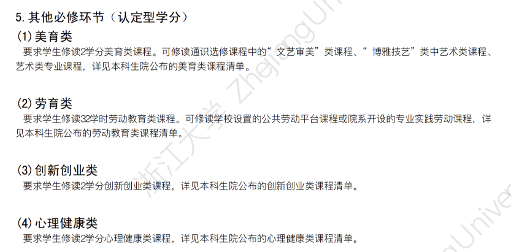
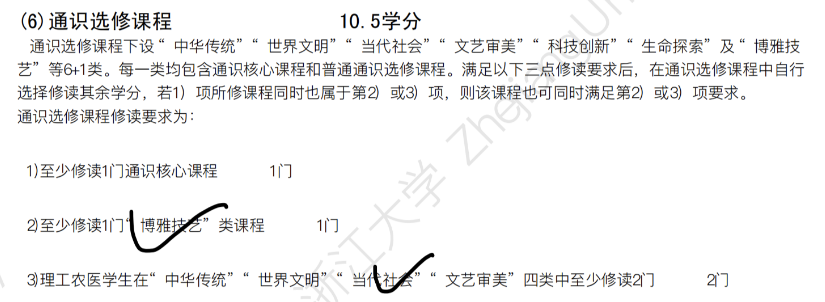

微观经济学、博弈论、心理学、说服术、伦理学
## 2025春夏选课

**把水课下成一盘大棋！规划好自己的时间！**

- 旁听一门心理学

    问问sdf学长

- 自学说服术

- 辅修金融学

### 通识

#### 通核

- 幸福心理学（通核 + 心理健康
    
    1）期末开卷考试，占30%

    2）课堂随机测试四次，占8%

    3）课后练习（行为监测表、创意名片等），占10%

    4）讨论投入与表现（知识点掌握情况、活动参与度等，由助教评价），占12%

    5）课后智慧树平台课程学习（视频和习题），占30%

    6）课堂测量和反馈（课堂问卷完成及发言情况），占10%

- 新制度经济学（通核 + 当代社会
    
    文献阅读作业：30%

    平时表现（小组讨论与课堂展示）：30%

    期末闭卷考试：40%

- 大脑与社会

    期末考试成绩：闭卷，占30%；

    期末论文成绩：占20%；

    平时测试成绩：占20%；

    口头讨论课成绩：占30%

- 先秦诸子思想

    课程评分规则如下：平时讨论50%，期末口试50%。

    出勤率：每缺课一次扣除总评分5分，缺课三次以上取消成绩。

#### 四选二

- 博弈论基础 
- 汇编通识 （能学到东西）
- 微信小程序设计 （能学到东西）
- 区块链 （能学到东西）
- 经济法理论与实务 （水）

- vivado 
- verilog

