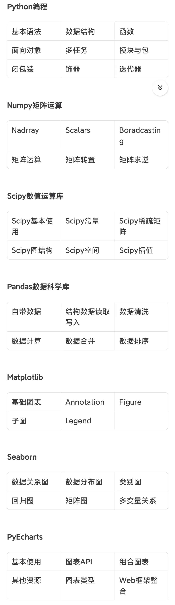

今日份计划：<input type="text" value="" style="width:100%;"><u></u></input>

## CS plan

[编程指北](https://csguide.cn/)

- [ ] 编程风格

- [ ] python基础, CS61a

    

- [ ] C深入

- [ ] 以前接触过的各种奇奇怪怪的东西学明白

    - 网络传输协议
    - 接口
    - IP
    - mkdocs研究明白
    - github

- [ ] Cpp
    
    [咸鱼暄Cpp](https://xuan-insr.github.io/cpp/cpp_restart/)

- [ ] HTML CSS (JS)

- [ ] LaTex 

- [ ] Docker

- [ ] CS50x

- [ ] missing semester

## Others

### Books

- [ ]《原则》

- [ ] 《自律》

希望你能在读完这两本书之后将其用于实践！

- [ ] 《纳瓦尔宝典》

- [ ] 自己研究几本CS经典书籍，看看[编程指北的学习路线](https://csguide.cn/aboutme/programming_road.html)

- [ ] 研究几本讲人际关系为人处世情商相关的书

## Thinking & mics

- [ ] 想清楚我的人生规划、未来目标，并说服自己在接下来的 $ \frac78$ 时光里无条件的为之奋斗

- [ ] 大学里面东西的取舍，“不断获取信息差，找到最优解”

    - 培养方案
    - 学生手册
    - 保研出国

- [ ] 弄明白这个学校运行的规则

- [ ] 下学期的学习状态、生活状态

- [ ] obsidian用起来

- [x] 