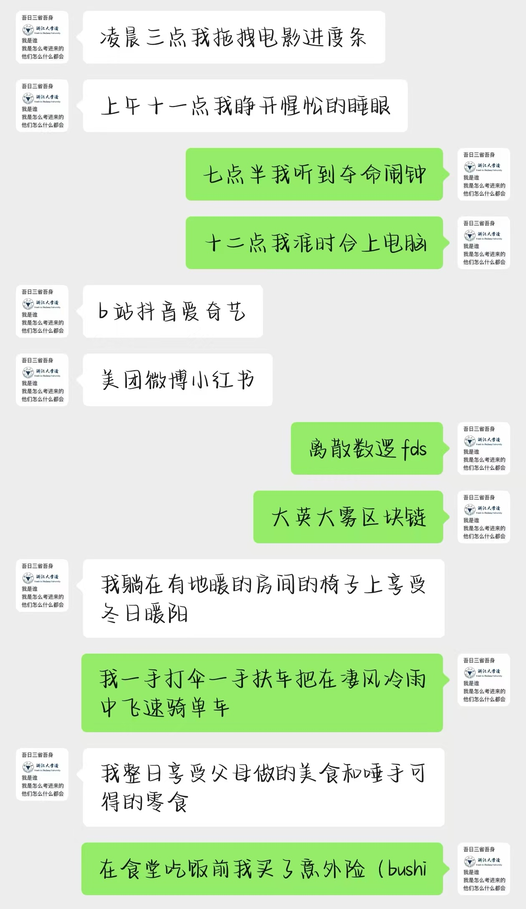
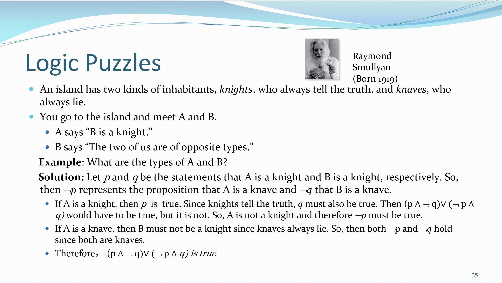
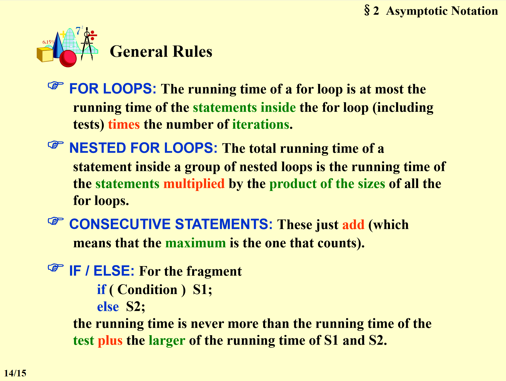
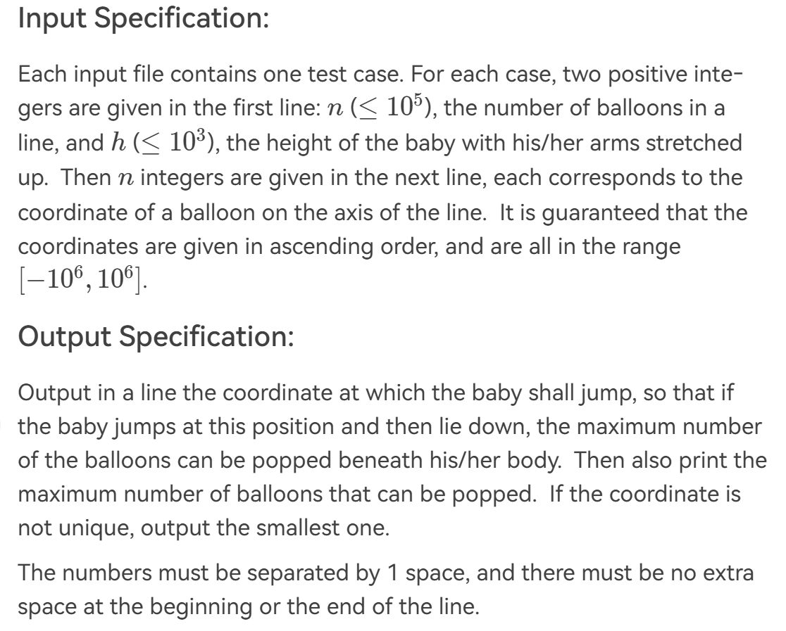

cd周二

- 书包
    - 厚重的课本和空白的大脑
- 下楼
- 早餐
- 通勤
- 教学楼
    - 24/67656
- 上课
    - 离散
    - 数逻
    - 微积分
- 下课(人)
- 午餐
- 午觉
- 自习
- 上课
- 游戏
- 写东西
- 出游

再次见到有人用翻译🖊居然是再离散课上......

## 开学一周

情人节，准时投入浙江大学的怀抱，令人遗憾的是，学校并没有给我分配对象……

1946年2月14日，世界上第一台电子计算机“电子数字积分计算机”在宾夕法尼亚大学问世，所以我决定在这一天好好陪陪我的电脑。

所以一直在感慨，列表中那些光速脱单的朋友们一定是风流倜傥仪表堂堂or沉鱼落雁闭月羞花，若非，则定有经天纬地之才，我只得自惭形秽了罢。

咳咳，进入正题

作为目前已知开学最早的学校的最卷院系中的底层牛马，第一周毫无疑问是毁灭性的：

凌晨三点我拖拽电影进度条，上午十一点我睁开惺忪的睡眼。

七点半的夺命闹钟，十二点又准时合上电脑。

b站抖音爱奇艺，美团微博小红书

离散数逻fds，大英大雾区块链，

我躺在有地暖的房间的椅子上享受冬日暖阳

我一手打伞一手扶车把在凄风冷雨中飞速骑单车，

我整日享受父母做的美食和唾手可得的零食

在食堂吃饭前我买了意外险（bushi

感谢一周五节的早八，让我每天早晨都能见识到食堂玻璃上的雾气、阳明桥的车流、东教前的共享单车，以及每天甚至不需要思考几点睡觉否则本就听不懂的成群的英语课上我将更加迷茫。

如果问我每天什么时间学英语，我将回答：周二8：00~9：35、13：25~17：50，周三10：00~11：35，周四14：15~15：50、周五8：00~9：35。

原因如下~

下课之后我已经很离散了……

对C语言死去的记忆开始攻击我……

我懂数字也略懂逻辑，为什么不懂数字逻辑设计，难道问题出在不懂设计吗？

本就一点也不慈眉善目的PTA也变得如此面目狰狞

如果你问为什么英语课上不学英语，我也不知道为什么（了解我的朋友应该都知道为什么……

小时候，向往多少楼台烟雨中，憧憬画船听雨眠，如今更赞同阴风怒号浊浪排空，更愿意相信凄风冷雨满江城。浑身湿透走进教室，忍受着潮湿与寒冷，艰难地理解老师口中的方言，如果忘记带伞或者从图书馆走出来发现我的伞莫名丢失，惨状更加难以言喻……

希望是本无所谓有，无所谓无的。

看到含苞待放的桃花，浅浅期待宿舍区盛放的樱花，偶尔在树杈间看到小松鼠，或许可以稍稍消解上课带来的痛苦罢。

于是我不禁问，春天来了，冬天还会远吗？